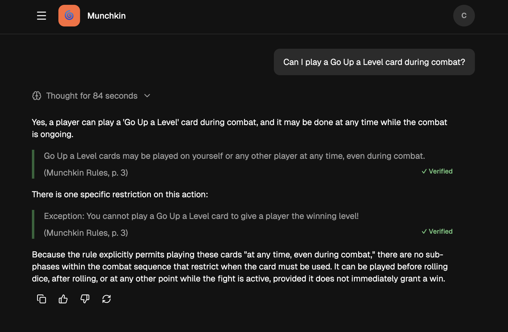
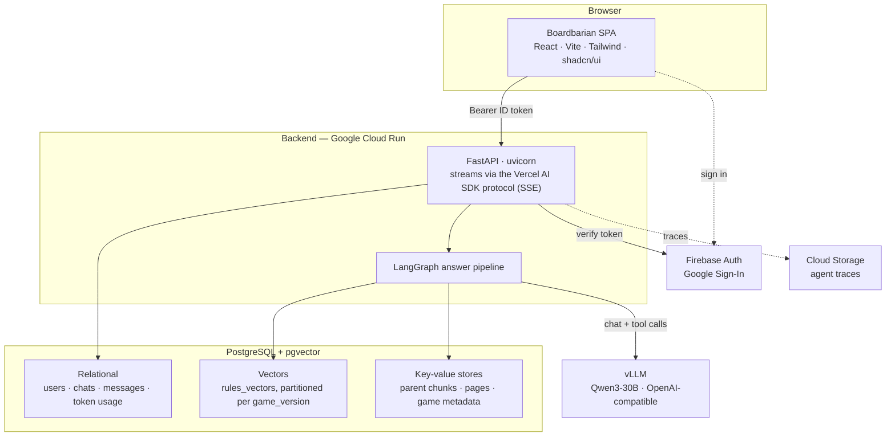
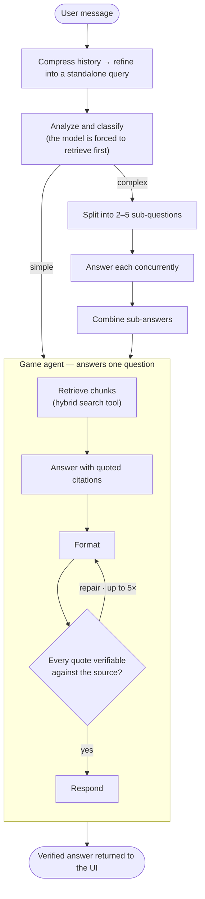
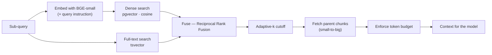
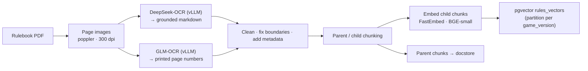
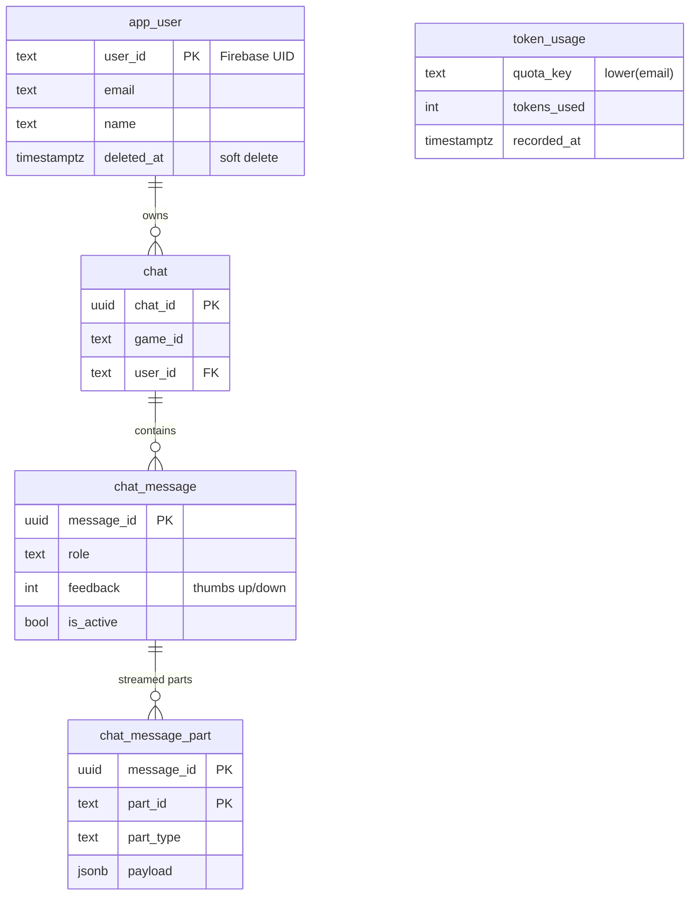

<p align="center">
  
</p>

<h1 align="center">MeepleMate</h1>

<p align="center">
  <strong>An AI assistant that answers board-game rules questions — with citations straight from the rulebook.</strong><br/>
  <em>The retrieval-augmented system that powers the <b>Boardbarian</b> web app.</em>
</p>

<p align="center">
  <a href="https://boardbarian.web.app/"><strong>🔗 Live demo — boardbarian.web.app</strong></a>
</p>

<p align="center">
  
  
  
  
  
  
  
</p>

<p align="center">
  
</p>

<p align="center">
  <sub><em>A live answer in Boardbarian — every quoted rule is checked against the source and marked ✓ Verified.</em></sub>
</p>

---

## Contents

- [What is MeepleMate?](#what-is-meeplemate)
- [Highlights](#highlights)
- [System architecture](#system-architecture)
- [How a question is answered](#how-a-question-is-answered)
- [Retrieval design](#retrieval-design)
- [Ingesting a rulebook](#ingesting-a-rulebook)
- [Technology choices & rationale](#technology-choices--rationale)
- [Data model](#data-model)
- [Evaluation](#evaluation)
- [Project layout](#project-layout)
- [Getting started](#getting-started)
- [Command-line tools](#command-line-tools)
- [Configuration](#configuration)
- [Further reading](#further-reading)

---

## What is MeepleMate?

Board-game rules are notoriously hard to look things up in: the answer to "can I play a *Go Up a Level* card during combat?" is often spread across several pages, buried in exceptions, and phrased in game-specific jargon. MeepleMate answers those questions in plain language **and quotes the exact rulebook passage it relied on**, so you can trust the answer and find it yourself.

Under the hood it is a full retrieval-augmented generation (RAG) system: it retrieves the most relevant rulebook passages first, then asks the model to answer from that evidence. The system is built around a few deliberate ideas:

- **Answers are grounded in the source.** Every quoted passage in an answer is verified back against the retrieved rulebook text; anything that can't be matched is repaired or removed. Getting a rule *wrong* is worse than saying "I'm not sure," so the pipeline is built to be honest.
- **It supports open-weight models you host yourself.** The local stack serves Qwen3 and the OCR models with [vLLM](https://github.com/vllm-project/vllm), keeping inference under the operator's control. OpenAI-compatible endpoints make the deployment portable, while cost-weighted quotas bound usage regardless of where inference runs.
- **It's a real application, not a notebook.** Google Sign-In, per-user rate limiting, streaming chat, account deletion / privacy handling, database migrations, a container image built and tested in CI, and an offline document-ingestion pipeline are all here.

> **Naming:** the project/repository is **MeepleMate**; the deployed web app is branded **Boardbarian**. They're the same thing.

---

## Highlights

| | |
|---|---|
| 🔎 **Cited, verified answers** | Every quote is fuzzy-matched back to the retrieved source text and corrected or dropped if it can't be verified — a concrete guardrail against hallucinated rules. |
| 🧠 **Agentic, multi-step reasoning** | A [LangGraph](https://langchain-ai.github.io/langgraph/) pipeline classifies each question, decomposes complex ones into sub-questions answered in parallel, retrieves evidence via tool calls, and self-checks its own output. |
| 🔀 **Hybrid retrieval** | Dense vector search **and** full-text search over pgvector, fused with Reciprocal Rank Fusion — so exact terms (card names, keywords, numbers) aren't lost the way pure embeddings lose them. |
| 🖼️ **OCR ingestion for image-heavy PDFs** | Rulebooks are rendered to images and read by a self-hosted vision model into clean, structured markdown, with printed page numbers recovered separately for accurate citations. |
| 🧩 **Self-hosted LLMs with failover** | The system supports an ordered list of OpenAI-compatible models; when multiple endpoints are configured, a per-model circuit breaker can route around a degraded endpoint. |
| 💸 **Budget-based rate limiting** | Usage is metered as *cost-weighted tokens* against per-user and app-wide dollar budgets over rolling 8h / 7d / 30d windows. |
| 📊 **A real evaluation harness** | `deepeval`-based correctness judging plus custom quote-validity and runaway-generation metrics, with grid/sampling hyperparameter search and run-to-run variance analysis. |

---

## System architecture



The frontend is a static single-page app (it can even be served straight from a CDN). Firebase issues the user's identity token; the backend only ever *verifies* tokens. A single FastAPI service handles every request, and the answer itself is produced by a LangGraph pipeline that talks to Postgres (for both relational data and vector search) and to a configured OpenAI-compatible model endpoint. The local development stack provides that endpoint with vLLM.

---

## How a question is answered

A chat turn hits `POST /api/chats/{chat_id}/stream`. After Firebase auth and a rate-limit check, the backend persists the user's message and opens a Server-Sent-Events stream (the Vercel AI SDK message-stream protocol) that reports progress as the graph runs.



1. **Refine.** History is trimmed to a token budget and the latest turn is rewritten into a self-contained query (so "what about during combat?" becomes a standalone question).
2. **Analyze & classify.** The model is forced to call the retrieval tool, then labels the question **simple** or **complex** and, if complex, produces 2–5 sub-questions.
3. **Answer.** Each question is handled by a "game agent" that retrieves evidence, drafts an answer with inline quotes, formats it, and then **validates every quote** against the retrieved text — looping back to fix problems up to five times. Complex questions run one game agent per sub-question concurrently and merge the results.
4. **Ground & respond.** Progress events are streamed while the graph runs. When it completes, the verified answer is emitted through the same SSE connection and stored as the assistant's message; token usage is recorded for rate limiting.

Every answer-pipeline model call flows through a **failover chat model**: it tries configured models in priority order and trips a per-model circuit breaker after repeated failures (defaults: 3 consecutive failures, 300s cooldown). When multiple endpoints are configured, this lets the pipeline route around a flaky endpoint instead of immediately failing the request.

---

## Retrieval design

Retrieval is a tool the agent calls, not a fixed first step — and it does more than a nearest-neighbor lookup:



- **Hybrid search.** Dense embeddings are great at meaning but miss exact strings; full-text search catches the card names, keywords, and numbers that rules hinge on. The two result sets are fused with Reciprocal Rank Fusion so neither needs hand-tuned weighting.
- **Small-to-big (parent-document) retrieval.** Small child chunks are embedded for precise matching, but the *parent* chunks are returned so the model gets enough surrounding context.
- **Adaptive-k.** Instead of always returning a fixed number of chunks, the cutoff adapts to how relevant the results actually are, then a token budget caps the context.
- **Per-game partitioning.** Vectors live in a `rules_vectors` table partitioned by `game_version`, so retrieval is scoped to the right game (and the right edition) and old versions can be swapped out cleanly.

---

## Ingesting a rulebook

Rulebooks are image-heavy PDFs, so getting good text out of them is its own pipeline (run via the `mm-ingest` CLI — see [`docs/ingestion.md`](docs/ingestion.md) for the full walkthrough):



Pages are rendered to PNGs, read by a self-hosted **DeepSeek-OCR** vision model into *grounded* markdown (text plus bounding boxes), while a separate **GLM-OCR** pass recovers the printed page numbers used in citations. The markdown is cleaned (dangling sentences merged across page breaks, headers annotated), split into a parent/child chunk hierarchy, embedded, and upserted into pgvector; parent chunks, full pages, and generated game metadata go to Postgres key-value stores. Reference summaries and example questions are generated with the chat model along the way.

---

## Technology choices & rationale

| Choice | Role | Why |
|---|---|---|
| **FastAPI + uvicorn** | HTTP API & streaming | Async-first with first-class SSE streaming and pydantic models; a natural fit for a single, thin service. |
| **LangGraph** | Orchestration | The answer flow is genuinely multi-step (classify → decompose → retrieve → answer → self-verify). A typed state graph makes that explicit, debuggable, and streamable — unlike an opaque chain. |
| **Self-hosted vLLM + Qwen3** | LLM inference | The local stack provides full control over model selection, sampling, and tool-calling. The OpenAI-compatible API keeps alternative self-hosted or managed endpoints a configuration change away. |
| **Failover model + circuit breaker** | Resilience | When multiple endpoints are configured, ordered failover with per-model breakers routes around transient provider failures. |
| **PostgreSQL + pgvector** | Storage & vector search | One database for relational data *and* vectors — far fewer moving parts to run, back up, and keep consistent than a separate vector store. |
| **Hybrid search + RRF** | Retrieval quality | Embeddings miss exact terms that rules depend on; full-text catches them; RRF fuses both without weight tuning. |
| **Parent-document retrieval** | Retrieval quality | Precise matching on small chunks, enough context from their parents. |
| **FastEmbed / BGE-small (384-d)** | Embeddings | Small, fast, CPU-friendly, and baked into the image for quick cold starts. |
| **DeepSeek-OCR / GLM-OCR (vLLM)** | Ingestion | Grounded OCR turns visual PDFs into structured, citable markdown with real page numbers. |
| **Firebase Auth** | Identity | Offloads Google Sign-In and token issuance; the backend only verifies tokens. |
| **React + Vite + Tailwind + shadcn/ui + Vercel AI SDK** | Frontend | A fast SPA speaking a standard streaming-chat protocol the backend implements natively. |
| **Docker Compose (GPU)** | Dev environment | One command brings up the whole GPU stack: chat model, optional OCR models, Postgres, and the Firebase Auth emulator. |
| **Google Cloud Run** | Deployment | Serverless containers with scale-to-zero economics for a personal project; the code includes Cloud Run-specific structured logging and cold-start handling. |

---

## Data model

Relational data is a small, deliberate schema (SQLAlchemy models in `meeplemate/db/models.py`, migrated with Alembic):



A few decisions worth calling out (full reasoning in [`docs/auth.md`](docs/auth.md)):

- **Accounts are keyed on the Firebase UID; budgets are keyed on the email.** A rate limit belongs to a *person* and must outlive any single account, so deleting and re-registering can't reset your budget — `token_usage` deliberately has no foreign key to `app_user`.
- **Deletion is a soft delete.** The row is flagged rather than removed, which stops access immediately even though Firebase ID tokens stay valid for up to an hour. Permanent purging is a separate, manual admin step.
- **Games aren't a relational table.** Game identity is a `game_id` string; rulebook content, pages, and metadata live in vector/key-value stores keyed by `game_id` / `game_version`.

---

## Evaluation

Answer quality is measured, not eyeballed. The `mm-eval` CLI runs the **production** QA graph over YAML-defined golden cases (`meeplemate/eval/test_cases.yaml`), persists the full run traces, and scores each answer with:

- **Correctness** — a `deepeval` `GEval` LLM-judge checking the answer reaches the same substantive conclusion as the reference answer.
- **Valid-quote rate** (`ValidQuoteMetric`) — the fraction of quotes in the answer that pass verification against the source.
- **Runaway-generation rate** (`RunawayGenerationsMetric`) — the fraction of generations that finished cleanly rather than hitting the length limit.

The judge itself is a local vLLM model, and there's tooling for **grid / sampling hyperparameter search** (`eval/grid_search.py`, `eval/sampling_search.py`), multi-run **variance analysis**, run-to-run comparison, and per-model **cost accounting**.

---

## Project layout

```
meeplemate/               # Python backend
  server/                 # FastAPI app, auth, rate limiting, deps, middleware
  chatloop.py             # top-level chat graph (compress → refine → answer)
  qa_graph.py             # coordinating agent + game agent (LangGraph)
  search.py               # hybrid chunk retrieval service
  quote_util.py           # quote / citation grounding & verification
  failover_chat_model.py  # multi-model failover + circuit breaker
  postgres/               # pgvector store + key-value stores
  db/                     # SQLAlchemy models, repository, data layer
  ingest/                 # rulebook ingestion pipeline (mm-ingest)
  eval/                   # deepeval-based evaluation harness (mm-eval)
  admin/                  # operator CLI (mm-admin)
  config.py               # pydantic-settings config + DI wiring
frontend/                 # React + Vite SPA (see frontend/README.md)
alembic/                  # database migrations
docs/                     # deep-dive docs (ingestion, auth, rate limits, legal)
notebooks/                # research notebooks
services/                 # Dockerfiles for the dev container, OCR, emulator
compose.yaml              # local GPU dev stack
docker/Dockerfile.api     # production API image
```

---

## Getting started

MeepleMate runs inside a **VS Code Dev Container** defined by [`compose.yaml`](compose.yaml). The default stack includes the vLLM chat model, so an **NVIDIA GPU is required** for the full backend; the OCR models are additional and gated behind Compose profiles.

1. **Prerequisites:** Docker + Docker Compose (v2.24+), and for the LLM services an NVIDIA GPU with the container toolkit.
2. **Bootstrap.** This copies [`.env.example`](.env.example) to `.env` when needed, records your UID/GID, and creates the local data directories:
   ```bash
   ./script/bootstrap
   ```
3. **Open in the dev container:** in VS Code, *Dev Containers: Reopen in Container* — or bring the stack up manually with `docker compose up -d`.
4. **Run the API + frontend** *from inside the container*:
   ```bash
   ./script/server
   ```
   The API serves on `:8000` and the Vite frontend on `:5173`.

**Frontend-only work** doesn't need the GPU stack — the SPA runs on plain Node against a remote (or bypassed) backend. See [`frontend/README.md`](frontend/README.md).

The example environment enables authentication bypass (`MM_AUTH_BYPASS=true` and `VITE_AUTH_BYPASS=true`) so the local stack works without a Firebase project. Remove those flags and configure Firebase credentials when testing real sign-in; details are in [`docs/auth.md`](docs/auth.md#bypass-mode-local-development).

---

## Command-line tools

Three working CLIs are registered in `pyproject.toml` and run from inside the dev container:

| Command | Purpose |
|---|---|
| `mm-ingest` | Turn a rulebook PDF into searchable, chunked, embedded data → [`docs/ingestion.md`](docs/ingestion.md) |
| `mm-eval` | Generate and score answers against golden test cases |
| `mm-admin` | Operator tasks (e.g. `purge-deleted-accounts`) |

---

## Configuration

Configuration is layered [`pydantic-settings`](https://docs.pydantic.dev/latest/concepts/pydantic_settings/), highest precedence first:

1. explicit init args
2. environment variables (`MM_` prefix, nested via `__`)
3. `.env` file
4. a YAML file pointed to by `MM_CONFIG_FILE` — [`config.yaml`](config.yaml) (production-leaning) or [`config-dev.yaml`](config-dev.yaml) (local dev)
5. model defaults

**Secrets** (database password, API keys) are typed `SecretStr` and come only from the environment / `.env` — they are never committed. The YAML files hold only non-secret settings: the model failover list and sampling parameters, embedding and Postgres settings, rate-limit budgets, Firebase project config, CORS, and tracing.

---

## Further reading

In-depth design docs live in [`docs/`](docs/):

- [`docs/ingestion.md`](docs/ingestion.md) — the full rulebook ingestion pipeline, step by step
- [`docs/auth.md`](docs/auth.md) — authentication, account / identity model, and the login & deletion flows
- [`docs/rate-limits.md`](docs/rate-limits.md) — how dollar budgets become cost-weighted token quotas
- [`docs/legal.md`](docs/legal.md) — consent, terms acceptance, and privacy handling

Research notebooks:

- [`notebooks/self_consistency.ipynb`](notebooks/self_consistency.ipynb) — exploring self-consistency for open-ended board-game questions
- [`notebooks/qa_service.ipynb`](notebooks/qa_service.ipynb) — driving the QA service directly
