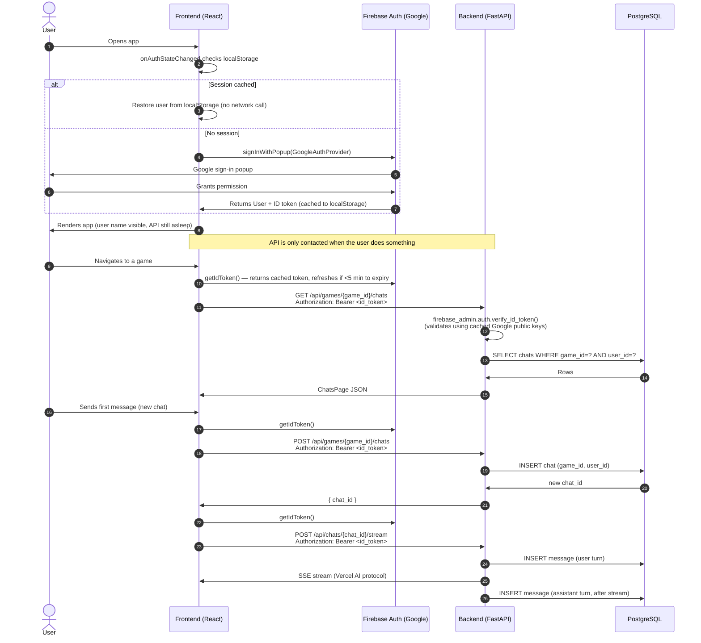
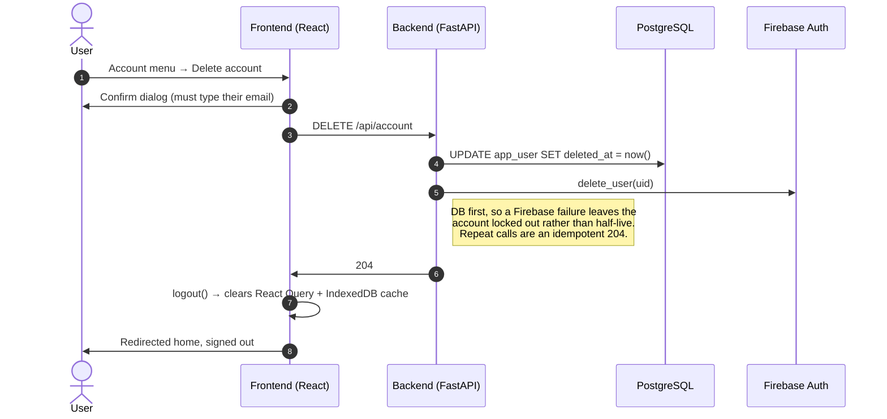

# Authentication

MeepleMate uses **Firebase Auth** (Google Sign-In) on the frontend and **Firebase Admin SDK** token validation on the backend. The Firebase JS SDK persists the session to `localStorage`, so user identity is available immediately on page load without waking the backend.

---

## Identity and rate-limit keys

Two keys, deliberately different, because they answer different questions.

```
app_user
  user_id     TEXT PK       <- the Firebase uid: identifies the ACCOUNT
  email, name
  deleted_at  TIMESTAMPTZ   <- NULL = live

token_usage
  quota_key   TEXT          <- lower(email): identifies the PERSON
  tokens_used, recorded_at
```

**Accounts** are keyed on the Firebase uid. Deleting a Firebase user is irreversible and the next sign-in mints a brand-new uid, so signing up again gives you a *different account* with no history. That's intentional: losing your history is the price of deleting your account, and it keeps the request path free of any way to claim data by email address.

**Budgets** are keyed on the email, because a rate limit belongs to a person and a person outlives any single uid. Keying `token_usage` on the uid would let anyone clear their 30-day budget by deleting their account and signing up again.

Pooling *usage* across an address is safe in a way that pooling *data* would not be: inheriting someone's consumption can only ever cost you tokens, so there's nothing to gain by claiming an address you don't own. Enabling email/password sign-up alongside Google would change that — an unverified registration could then drain a real user's budget — and would be the point to require a verified email before pooling.

`quota_key` falls back to the uid for tokens carrying no email (the deploy bot), which simply means those identities pool with nobody.

---

## Login flow



---

## Account deletion



It's a **soft** delete: the row is flagged rather than removed, which is what makes access stop immediately (see the stale-token row in the table below). The account and its chats are removed for good by `mm-admin purge-deleted-accounts`, run by hand.

Signing up again afterwards produces a new account with a new uid and no history. Their **token budget still follows them**, because `token_usage` is keyed on email — that's the whole reason for the split above.

---

## Security considerations

| Concern | How it's addressed |
|---|---|
| **Stale ID tokens after deletion** — Firebase ID tokens stay valid up to an hour and aren't revocation-checked per request | The row is soft-deleted rather than removed, so the lookup still finds it and returns 401. Every account-scoped endpoint resolves the account, so this covers reads as well as writes; access ends at once rather than at token expiry. |
| **Quota reset by delete-and-recreate** | `token_usage` is keyed on the email and has no FK to `app_user`, so consumption outlives the account. Purging an account deliberately leaves it in place. |
| **Purging one account clearing another's budget** | Same reason — usage rows are keyed by address, and two accounts can share one. The purge never touches `token_usage`; rows past the retention window are older than every rate-limit window anyway, so they no longer affect anyone. |
| **Accidental deletion** — sessions persist in `localStorage` indefinitely, so an unlocked browser is a real risk | The confirm dialog requires typing the account email, and says plainly that deletion can't be undone. |
| **Claiming another user's data by email** | Not possible: nothing in the request path resolves an account by email. This is the main reason the account key stayed the uid. |

---

## API endpoints and auth requirement

Two levels. **Gated** endpoints only need a valid project token. **Account-scoped** endpoints additionally look the account up, and therefore reject deleted accounts immediately rather than waiting for the token to expire.

| Endpoint | Level | Notes |
|----------|-------|-------|
| `GET /api/games`, `GET /api/games/{game_id}` | Gated | Catalog is identical for everyone. **See the deploy-bot note below — do not "upgrade" these.** |
| `GET /api/recent-games` | Account-scoped | Games the account has chatted in |
| `GET /api/games/{game_id}/chats` | Account-scoped | Filtered to the account |
| `GET /api/chats/{chat_id}/messages` | Account-scoped | 404 if the chat belongs to another account |
| `PUT`/`DELETE /api/messages/{id}/feedback` | Account-scoped | 404 if the message belongs to another account |
| `POST /api/chats/{chat_id}/stream` | Account-scoped | 404 if the chat belongs to another account; also rate-limited |
| `DELETE /api/account` | Account-scoped* | *Resolves deleted accounts too, so a retry after a partial failure isn't blocked by the flag the first attempt set |

Every endpoint validates the Bearer token via `get_current_user` before any handler logic runs; account-scoped ones then depend on `get_db_user` (in `meeplemate/server/deps.py`).

**The deploy-bot exception.** The frontend deploy snapshots `/api/games` into the CDN's `games.json` using a token minted from the service account for a synthetic `deploy-bot` uid (`script/mint-id-token.mjs` in the infra repo). That token carries **no email** and has no `app_user` row. Making the catalog endpoints account-scoped would mint a junk user row on every deploy — so they must stay gated. `tests/test_api_games.py` asserts this.

---

## Bypass mode (local development)

Bypass mode disables all token validation and injects a hardcoded user. No Firebase project credentials are needed.

**Backend** — add to `.env` (or Docker Compose environment):

```
MM_AUTH_BYPASS=true
MM_AUTH_BYPASS_USER={"uid":"local-dev","email":"dev@local","name":"Dev User"}
```

**Frontend** — add to `frontend/.env.local`:

```
VITE_AUTH_BYPASS=true
VITE_AUTH_BYPASS_USER={"uid":"local-dev","email":"dev@local","name":"Dev User"}
```

With both set: the Firebase SDK is never initialized, no login redirect occurs, and `getIdToken()` returns the string `"bypass-token"` (which the backend ignores). You can change the `uid` to test user-scoping behaviour with different fake users — and changing the `uid` while keeping the `email` simulates a user who deleted their account and signed up again: new account, no history, same token budget.

### Emulator persistence

The auth emulator runs with `--import`/`--export-on-exit` against a named volume, so users survive `docker compose down`. Without it the emulator was purely in-memory: every restart wiped the users, the next sign-in minted a **new uid for the same person**, and since the uid is the account key that silently created a second account and stranded the old chats. One dev address had accumulated 18 accounts before this was noticed. If you ever need a clean slate, `docker volume rm meeplemate_firebase_emulator_data`.

`MM_AUTH_BYPASS_USER` also accepts the two claims the resurrection gate reads, so both branches can be exercised locally without a Firebase project:

```
MM_AUTH_BYPASS_USER={"uid":"local-dev","email":"dev@local","name":"Dev User","email_verified":true,"sign_in_provider":"google.com"}
```

Changing only the `uid` while keeping the same `email` and `sign_in_provider` simulates a user returning after deletion; changing `sign_in_provider` to `"password"` simulates the takeover attempt the gate is there to refuse. Firebase user deletion itself is a no-op in bypass mode.
