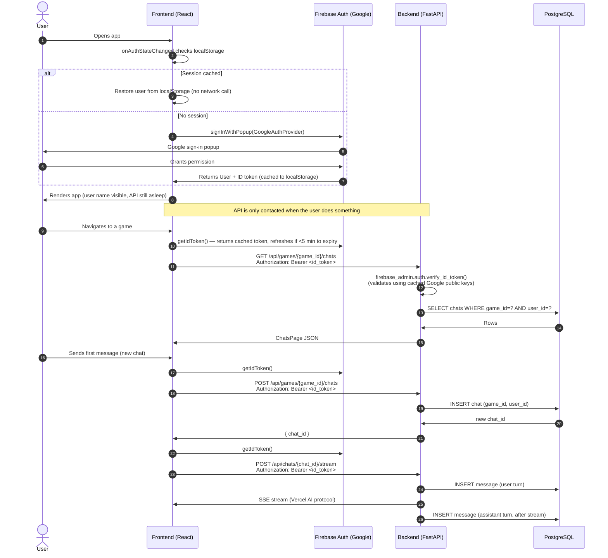
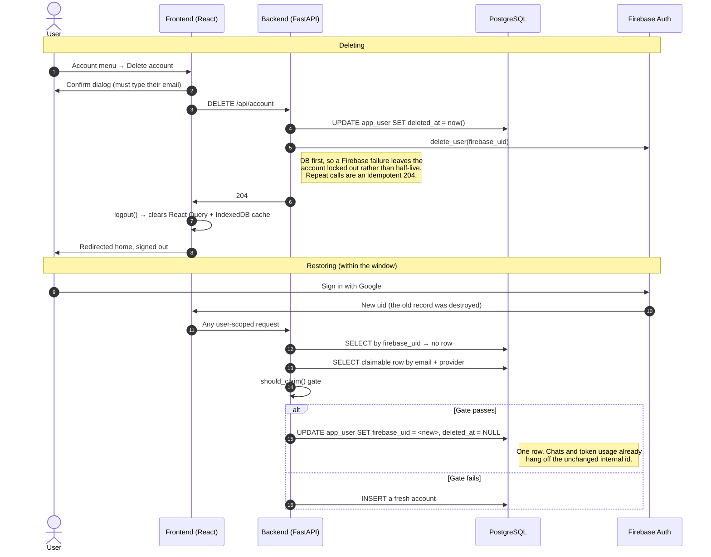

# Authentication

MeepleMate uses **Firebase Auth** (Google Sign-In) on the frontend and **Firebase Admin SDK** token validation on the backend. The Firebase JS SDK persists the session to `localStorage`, so user identity is available immediately on page load without waking the backend.

---

## Identity model

Firebase is the *authenticator*, not the *key*. Two different identifiers, with different lifetimes:

```
app_user
  id                UUID   PK, immutable          <- what chat.user_id and token_usage.user_id reference
  firebase_uid      TEXT   UNIQUE, mutable        <- the external identity, re-pointed when an account is restored
  email             TEXT
  name              TEXT
  sign_in_provider  TEXT                          <- "google.com" | "password" | "custom" | ...
  deleted_at        TIMESTAMPTZ                   <- NULL = live
  metadata          JSONB                         <- per-user rate limit overrides
```

The split exists because **a Firebase uid does not durably identify a person**. Deleting a Firebase user is irreversible, so the next sign-in mints a brand-new uid; the dev emulator has no persistence, so it does the same on every container restart. If the uid were the primary key, restoring an account would mean rewriting every row that user owns; with an internal id it's a single-row `UPDATE` that re-points `firebase_uid`.

This is not hypothetical. Before the internal id existed, `upsert_user` looked accounts up *only* by `firebase_uid`, so a changed uid silently forked one person into a second account — splitting their chat history and, because `token_usage` went with it, **handing them a fresh rate-limit budget**. One dev address had accumulated 18 accounts this way. `should_claim` now adopts a live account whose uid changed (§ Security considerations), a partial unique index on `(lower(email), sign_in_provider)` for live rows backstops it, and migration `0002` merged the accounts already split.

The practical consequence for handlers: `AuthUser.uid` identifies the *credential* and is only good for logging and for talking to Firebase. `UserRecord.id` identifies the *account* and is the only thing that may be used to look up owned data. Resolving one to the other is a database read — see the endpoint table below for which endpoints do it.

Three schemas are common for "external auth provider + own database": provider uid as the PK (simplest, until the uid has to change); a surrogate PK with the provider uid as a mutable column (what we do, and the documented pattern for Firebase + Postgres); and a separate identity table, one user row to N provider identities, as NextAuth and Auth0 do. The third is the natural next step if a second sign-in provider is ever added — `firebase_uid` + `sign_in_provider` on the user row is a degenerate one-identity-per-user form of it.

---

## Login flow



---

## Account deletion

Deleting an account is a **soft delete**. Signing in again with the same Google account restores everything while the account is still inside `RESURRECTION_WINDOW` (`meeplemate/db/account_recovery.py`, currently 90 days); past that it is no longer restorable and `mm-admin purge-deleted-accounts` removes it and its data for good.

The window is deliberately **longer than the longest rate-limit window** (`30D`). Token usage follows the account, so a returning user past the window starts a fresh ledger — if the grace period were shorter than the budget period, deleting and signing back in would clear a quota that was still being enforced. Don't lower it below 30 days.



What survives the window: chats, messages, token usage, and per-user rate limit overrides. What a returning user sees after it lapses: a clean, empty account.

---

## Security considerations

Two situations bring a known person back under an unknown uid, and `should_claim` in `meeplemate/db/account_recovery.py` governs both — as a pure function, so the rules can be read and tested in one place:

- **Adoption** — the account is live but its uid changed (emulator restart; shouldn't happen in production, where a Google identity keeps its uid). Re-points `firebase_uid` instead of forking the person into a second account.
- **Resurrection** — the account was soft-deleted and they're back inside `RESURRECTION_WINDOW`.

Both are keyed on **email**, which is the sensitive part: a token bearing someone else's email must not be able to claim their account.

| Concern | How it's addressed |
|---|---|
| **Account takeover via email match** | `sign_in_provider` must match the value recorded on the row, so a `password` account can never claim a `google.com` one. `email_verified` is a secondary check, satisfied by a trusted IdP. Firebase's default [one-account-per-email](https://support.google.com/firebase/answer/9134820) blocks creating the second account in the first place. |
| **Adoption displaces a live account's current uid** | It gets exactly the same gate as resurrection, and grants nothing an ordinary sign-in wouldn't: reaching it means proving control of the same verified address at the same provider, and anyone who can do that would simply be handed the account's existing uid by the provider. Rows with no recorded provider are unclaimable until one ordinary sign-in records it. |
| **Silent quota reset via a changed uid** | Was real: a new uid meant a new account and a zeroed budget. Adoption keeps the person on one internal id, and the live-identity unique index stops a fork forming. |
| **Stale ID tokens after deletion** | Firebase ID tokens stay valid up to an hour and aren't revocation-checked per request. `firebase_uid` is deliberately **retained** on the deleted row, so the lookup finds it and returns 401. Because every user-scoped endpoint resolves the account, this applies to reads too, not just writes. |
| **Self-undelete by a stale token** | A row found *by uid* with `deleted_at` set is returned as-is and never falls through to the email path — otherwise the deleting user's own in-flight request could silently undo their deletion. Only a genuinely new uid can reach the resurrection gate. |
| **Quota reset by delete-and-recreate** | `token_usage` hangs off the immutable internal id, so consumption survives deletion and follows a restore. The grace period is kept longer than the longest rate-limit window, so an expired account can't be used to clear a budget that is still in force either. |
| **Indefinite retention of "deleted" data** | Restorability is decided *in the gate*, not by the purge job, so what a returning user experiences never depends on when an operator last ran the CLI — the job only reclaims storage. Note this bounds *access*, not storage: until the purge runs, an expired account's rows are still on disk, which is why the delete dialog promises no retention period. |
| **Accidental deletion** | Sessions persist in `localStorage` indefinitely, so the confirm dialog requires typing the account email, and the grace period makes a mistake recoverable rather than instant and permanent. |

**Residual risk, stated plainly:** someone who controls the victim's actual Google account can restore it — but that is a total compromise regardless of this feature.

`email_verified` is deliberately *not* the primary control. Firebase has a long-standing bug ([firebase-js-sdk#7702](https://github.com/firebase/firebase-js-sdk/issues/7702)) where the flag reads false even for Google sign-ins; requiring it outright would lock legitimate users out of restoring their own accounts, so a trusted IdP satisfies it instead.

---

## API endpoints and auth requirement

Two levels. **Gated** endpoints only need a valid project token. **Account-scoped** endpoints additionally resolve `firebase_uid → app_user.id`, and therefore reject deleted accounts immediately rather than waiting for the token to expire.

| Endpoint | Level | Notes |
|----------|-------|-------|
| `GET /api/games`, `GET /api/games/{game_id}` | Gated | Catalog is identical for everyone. **See the deploy-bot note below — do not "upgrade" these.** |
| `GET /api/recent-games` | Account-scoped | Games the account has chatted in |
| `GET /api/games/{game_id}/chats` | Account-scoped | Filtered to the account |
| `GET /api/chats/{chat_id}/messages` | Account-scoped | 404 if the chat belongs to another account |
| `PUT`/`DELETE /api/messages/{id}/feedback` | Account-scoped | 404 if the message belongs to another account |
| `POST /api/chats/{chat_id}/stream` | Account-scoped | 404 if the chat belongs to another account; also rate-limited |
| `DELETE /api/account` | Account-scoped* | *Resolves deleted accounts too, so a retry after a partial failure isn't blocked by the flag the first attempt set |

Every endpoint validates the Bearer token via `get_current_user` before any handler logic runs; account-scoped ones then depend on `get_db_user` (in `meeplemate/server/deps.py`).

**The deploy-bot exception.** The frontend deploy snapshots `/api/games` into the CDN's `games.json` using a token minted from the service account for a synthetic `deploy-bot` uid (`script/mint-id-token.mjs` in the infra repo). That token carries **no email**, has `sign_in_provider: "custom"`, and has no `app_user` row. Making the catalog endpoints account-scoped would mint a junk user row on every deploy — so they must stay gated. `tests/test_api_games.py` asserts this.

---

## Bypass mode (local development)

Bypass mode disables all token validation and injects a hardcoded user. No Firebase project credentials are needed.

**Backend** — add to `.env` (or Docker Compose environment):

```
MM_AUTH_BYPASS=true
MM_AUTH_BYPASS_USER={"uid":"local-dev","email":"dev@local","name":"Dev User"}
```

**Frontend** — add to `frontend/.env.local`:

```
VITE_AUTH_BYPASS=true
VITE_AUTH_BYPASS_USER={"uid":"local-dev","email":"dev@local","name":"Dev User"}
```

With both set: the Firebase SDK is never initialized, no login redirect occurs, and `getIdToken()` returns the string `"bypass-token"` (which the backend ignores). You can change the `uid` to test user-scoping behaviour with different fake users.

`MM_AUTH_BYPASS_USER` also accepts the two claims the resurrection gate reads, so both branches can be exercised locally without a Firebase project:

```
MM_AUTH_BYPASS_USER={"uid":"local-dev","email":"dev@local","name":"Dev User","email_verified":true,"sign_in_provider":"google.com"}
```

Changing only the `uid` while keeping the same `email` and `sign_in_provider` simulates a user returning after deletion; changing `sign_in_provider` to `"password"` simulates the takeover attempt the gate is there to refuse. Firebase user deletion itself is a no-op in bypass mode.
