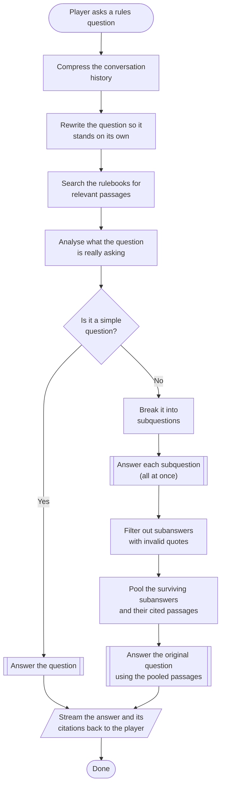
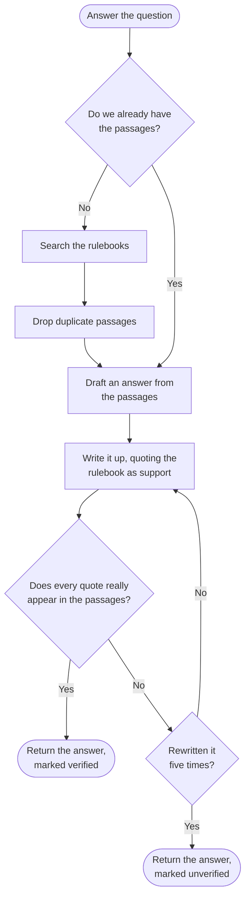

# How a rules question gets answered

The path a player's question takes, from the moment they ask it to the answer
coming back with rulebook citations attached.

This describes the flow rather than the implementation. For the code, see
`build_chatloop_graph` in `meeplemate/chatloop.py` and the three graph builders in
`meeplemate/qa_graph.py` (`build_coordinating_agent_graph`,
`build_analyze_question_graph`, `build_question_answer_graph`).

## Main flow

Simple questions get answered once; anything else is split up, answered piece by
piece, and reassembled.

## Answering a question

The boxed-in step above appears three times — for a simple question, for each
subquestion, and for the final pass over the pooled passages. It expands to this:

The only loop in the whole system is the rewrite that fires when the model quotes
something the rulebook doesn't actually say.

## Worth knowing

**Hard questions get answered several times over.** A question that isn't simple is
split into subquestions, each answered independently and in parallel. Their answers
and passages are then pooled and the original question is answered afresh on top of
them — so a complex question costs several model passes, not one.

**A subanswer that misquotes the rulebook is thrown away, not fixed.** Quote checking
happens twice: once per subanswer, where failure means the subanswer is silently
dropped from the pool, and again on the final answer, where failure triggers a
rewrite instead.

**Passages are searched for once and then reused.** The final pass over the pooled
passages skips searching entirely, because the subquestions already did that work.

**An unverified answer still reaches the player.** After five failed rewrites the
system stops trying and returns the answer flagged as unverified, rather than
failing outright.
